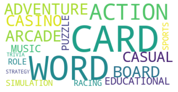
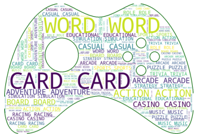
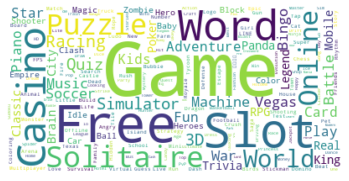
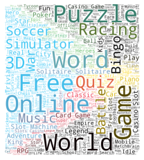

# Google Play Wordcloud 
 Wordcloud using Top Games on Google Play Store by fit the wordcloud into a specific image based on Genre and Title
 ## Dataset
 Dataset used in this project is [Top Games on Google Play Store](https://www.kaggle.com/dhruvildave/top-play-store-games) from Kaggle
 ## Result
 ### Genre Wordcloud
   
   
 ### Title Wordcloud
   
   
